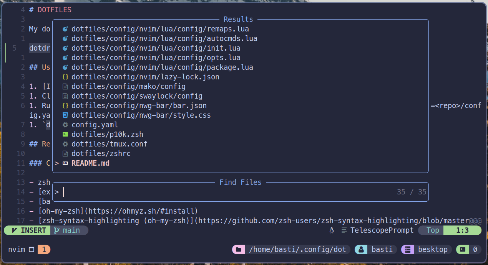
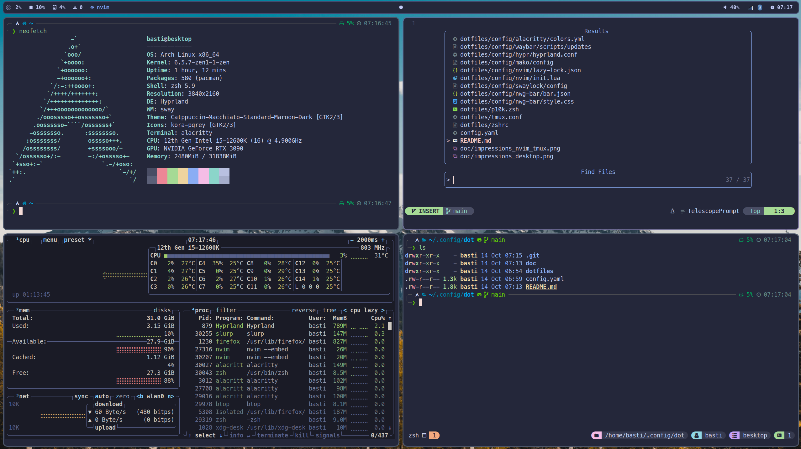

# DOTFILES

My dotfiles handled by [dotdrop](https://github.com/deadc0de6/dotdrop).

## Impressions

## Usage

1. [Install](https://dotdrop.readthedocs.io/en/latest/installation/) dotdrop as a package.
1. Clone the repository into a path of your choice, e.g. `~/.config/dot`.
1. Run `dotdrop` commands from within that repo or create an alias with `dotdrop="dotdrop --cfg=<repo>/config.yaml"`.
1. `dotdrop install -p <PROFILE>` (check `dotdrop profiles` for available ones)

## Requirements

### Common

- zsh
- [exa](https://itsfoss.com/exa/)
- [bat](https://github.com/sharkdp/bat)
- [oh-my-zsh](https://ohmyz.sh/#install)
- [zsh-syntax-highlighting (oh-my-zsh)](https://github.com/zsh-users/zsh-syntax-highlighting/blob/master/INSTALL.md#oh-my-zsh)
- [zsh-auto-suggestions (oh-my-zsh)](https://github.com/zsh-users/zsh-autosuggestions/blob/master/INSTALL.md#oh-my-zsh)
- [powerlevel10k (oh-my-zsh)](https://github.com/romkatv/powerlevel10k#oh-my-zsh)
- Nerd Font [MesloLGS NF](https://github.com/romkatv/powerlevel10k#manual-font-installation)
- (OPTIONAL) [fzf](https://github.com/junegunn/fzf)
- (OPTIONAL) [zoxide](https://github.com/ajeetdsouza/zoxide)
- tmux
- [tpm](https://github.com/tmux-plugins/tpm)
- nvim (neovim)

### `desktop` + `laptop`

- Arch Linux installation
- [hyprland](https://wiki.hyprland.org/)
- [mako](https://github.com/emersion/mako)
- [nwg-bar](https://github.com/nwg-piotr/nwg-bar)
- [swaylock](https://github.com/swaywm/swaylock)
- [tofi](https://github.com/philj56/tofi)
- [waybar](https://github.com/Alexays/Waybar)
- nm-applet
- blueman-applet
- Some `*.jpg` wallpapers in `~/wallpapers`
- [grimblast](https://github.com/hyprwm/contrib#grimblast)
- firefox

